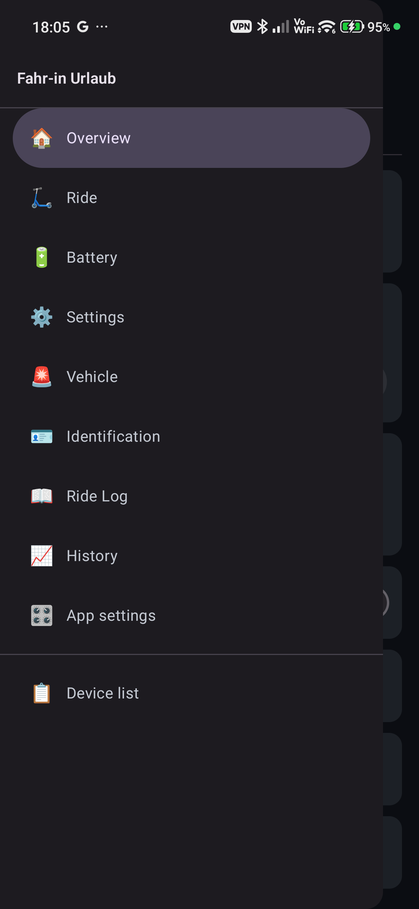
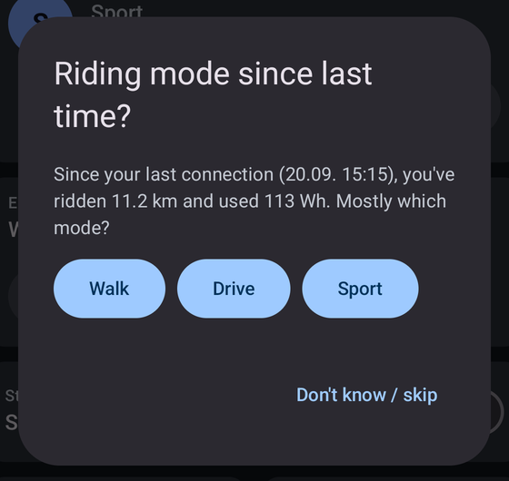
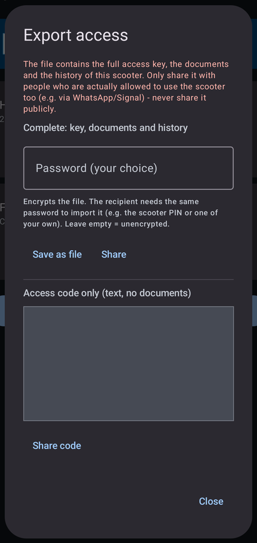

# Xiaomi Electric Scooter 5 / 5 Pro / 5 Max — Android-BLE-Client (Mi-Home-Alternative)

**[English](README.md) | Deutsch**

**Alternative Android-App für den Xiaomi Electric Scooter 5 Pro / 5 Max (der normale 5 sollte ebenfalls funktionieren) — Dashboard, Fahrmodi, Sperre, Akku- und Fahrdaten direkt per Bluetooth, ohne Mi-Home-App.**

Du suchst den **Elite, 5 Plus oder den 6 / 6 Lite / 6 Pro / 6 Max / 6 Ultra**? Diese Modelle werden **noch nicht unterstützt** — Stand und
Mithilfe siehe [Unterstützte Modelle](#unterstützte-modelle).

---

Ein eigenständiger Android-Client mit einsehbarem Quellcode (nicht-kommerzielle Lizenz) für **Xiaomi Electric Scooter** der 5er-Reihe
(getestet: 5 Pro und 5 Max; der normale 5 sollte ebenfalls laufen), der das Fahrzeug direkt per Bluetooth Low Energy anspricht — ohne
die offizielle Mi-Home-App. Das komplette BLE-Auth-Protokoll (ECDH P-256 → HKDF-SHA256 →
AES-CCM) wurde durch eigene Reverse-Engineering-Arbeit nachvollzogen und ist Byte für Byte
gegen beide realen Geräte verifiziert.

Dies ist ein unabhängiges, nicht-kommerzielles Projekt ohne Verbindung zu Xiaomi.

## ⚠️ Haftungsausschluss

**Die Nutzung dieser Software erfolgt vollständig auf eigenes Risiko. Der Autor übernimmt keinerlei
Haftung für Schäden, Verletzungen, Bußgelder, Garantieverlust, Kontosperrungen oder sonstige
Folgen jeder Art, die aus der Nutzung, Installation oder Modifikation dieser Software entstehen
— unabhängig davon, ob diese Folgen vorhersehbar waren oder nicht.** Das gilt in vollem, gesetzlich
zulässigem Umfang (siehe auch [LICENSE](LICENSE), Abschnitt "No Liability", die rechtlich bindende
Fassung dieses Ausschlusses).

- **Keine Verbindung zu und keine Unterstützung durch Xiaomi.** Dieses Projekt steht in keiner
  Beziehung zu Xiaomi Corporation oder verbundenen Unternehmen, ist nicht von Xiaomi autorisiert,
  gesponsert oder geprüft. Alle Marken- und Produktnamen gehören ihren jeweiligen Inhabern.
- **Keine Gewährleistung, keine Garantie für Funktion, Sicherheit oder Korrektheit.** Die Software
  wird **"as is"**, ohne jede ausdrückliche oder stillschweigende Zusicherung bereitgestellt —
  weder für Eignung zu einem bestimmten Zweck noch für Fehlerfreiheit. Ein durch Reverse
  Engineering nachgebautes Protokoll kann Fehlinterpretationen enthalten; fehlerhafte Befehle
  könnten im ungünstigsten Fall dein Gerät beschädigen, Fahrfunktionen beeinträchtigen oder zu
  unerwartetem Verhalten während der Fahrt führen.
- **Verantwortung für Straßenverkehr und Sicherheit liegt vollständig bei dir.** Die App zeigt bei
  bestimmten Einstellungen (z.B. Tempomat, Beleuchtung) Warnhinweise an — das ersetzt keine eigene
  Prüfung der in deinem Land/deiner Region geltenden Vorschriften für Elektrokleinstfahrzeuge.
  Nutze keine Funktion während der Fahrt in einer Weise, die dich selbst oder andere gefährdet
  oder gegen geltendes Recht verstößt.
- **Nur für eigene Geräte verwenden.** Die Software ist für Interoperabilität mit Geräten gedacht,
  die dir (oder Personen, die dir ausdrücklich Zugriff gewähren, z.B. über die
  Export/Import-Funktion) gehören — nicht für fremde Geräte ohne Zustimmung des Eigentümers.
- **Getestet am Xiaomi Electric Scooter 5 Pro und 5 Max** (BLE-Chip RTL8762C, Firmware
  2.7.0_0015.x). Der normale **Electric Scooter 5** (ohne „Pro"/„Max") **sollte ebenfalls
  funktionieren**, wurde aber nicht getestet. Weitere Modelle: siehe „Unterstützte Modelle" unten — **nutze die
  App nicht mit einem Modell, das dort nicht als getestet steht**, sie könnte falsche Werte zeigen oder die falschen
  Einstellungen ändern.
- **Keine Geschwindigkeitsbegrenzung wird umgangen.** Dieses Projekt implementiert bewusst
  **keine** Funktion zum Ändern der regionalen Geschwindigkeitsbegrenzung oder zum Beschreiben
  der Motorsteuerungs-Firmware — das würde physischen ST-Link/SWD-Zugriff auf den Motorcontroller
  erfordern und wurde absichtlich nicht gebaut, unabhängig vom Anwendungsfall. Wer diesen Code
  als Ausgangspunkt für sowas nimmt, tut das eigenverantwortlich und außerhalb dessen, wofür
  dieses Projekt gedacht ist.
- **Cloud-Zugangsdaten und Nutzungsbedingungen.** Der Cloud-Login-Teil spricht undokumentierte,
  interne Xiaomi-Cloud-Schnittstellen an. Das kann gegen die Nutzungsbedingungen deines
  Xiaomi-Kontos verstoßen; im ungünstigsten Fall könnte das zu Einschränkungen deines Kontos
  führen. Passwort und Geräte-PIN werden nirgends fest im Code und auch nicht auf deinem Gerät
  gespeichert — sie werden nur für den einmaligen Login bzw. Schlüsselabruf gebraucht; abgelegt wird
  nur der daraus gewonnene BLE-Schlüssel, verschlüsselt über den Android Keystore — trotzdem
  gilt: Nutzung dieser Schnittstellen ist eigenverantwortlich. Dasselbe gilt für den exportierten
  Zugangscode und die Exportdatei (Export/Import-Funktion): sie enthalten den vollständigen
  BLE-Schlüssel eines Geräts (die Datei zusätzlich Dokumente und Verlauf) und sollten nur an
  Personen weitergegeben werden, die dieses Gerät auch tatsächlich mitbenutzen dürfen — die Datei
  am besten mit Passwort verschlüsselt.
- **Persönliche Dokumente.** Die Dokumente-Funktion legt Fotos/PDFs deiner Unterlagen (z.B.
  Versicherungsbestätigung) im app-privaten Speicher deines Handys ab (nicht in der Galerie,
  unverschlüsselt); die Originalfotos der Kamera bleiben allerdings in deiner Galerie. Für den
  Umgang mit diesen personenbezogenen Daten bist du selbst verantwortlich. Ob eine digitale Kopie
  bei einer Kontrolle akzeptiert wird, entscheidet die kontrollierende Stelle — das ist keine
  Rechtsberatung; im Zweifel die Originale mitführen.
- **Sicherung und App-Sperre.** Ein Sicherungs-Passwort ist optional. Wenn du eins setzt, lässt sich die
  Sicherung ohne es nicht wiederherstellen — es gibt keine Rücksetzung. Eine Sicherung ohne Passwort kann
  jeder öffnen, der die Datei bekommt (sie enthält deine Scooter-Schlüssel und Dokumente); gib sie also nur
  an Vertraute weiter. Die App-Sperre schützt vor zufälligem Zugriff auf die App-Oberfläche, ist aber
  keine Garantie gegen gezielte Angriffe auf das Handy.
- **Kein Support, keine Zusicherung von Weiterentwicklung.**
  Xiaomi kann das Protokoll jederzeit per Firmware-Update ändern und diese Software funktionsunfähig
  machen, ohne dass eine Aktualisierung dieses Repositories zu erwarten ist.

## Unterstützte Modelle

| Modell | Stand |
|---|---|
| Electric Scooter **5 Pro**, **5 Max** | Getestet (BLE-Chip RTL8762C, Firmware 2.7.0_0015.x) |
| Electric Scooter **5** (normal) | Sollte funktionieren (gleiche Modellgruppe mit privater Wertetabelle), ungetestet |
| Electric Scooter **6 Max** | **Nur lesend**, experimentell: vermutlich wie die 5er-Reihe, nicht bestätigt |
| **Elite, 5 Plus, 6, 6 Lite, 6 Pro, 6 Ultra** | **Noch nicht unterstützt.** Ihre Werte sind anders nummeriert; die App zeigt und ändert für sie nichts und bietet nur den rein lesenden Bericht „Werte erkunden" |

**Warum diese Einschränkungen:** Die App spricht mit dem Scooter über nummerierte Werte („Properties"). Die Nummern
unterscheiden sich je Modell, und eine falsche Tabelle würde falsche Werte zeigen oder — schlimmer — auf das falsche
Property schreiben. Deshalb schreibt die App nur bei bekannten Modellen, behandelt den 6 Max nur lesend und sperrt
alle Änderungen bei unbekannten Modellen. Ist das Modell unbekannt (z. B. per Exportcode hinzugefügt), werden die
ersten Messwerte geprüft und Änderungen gesperrt, wenn sie nicht passen. **Diese Prüfung erkennt nicht jeden Fall**:
Antwortet ein unbekannter Scooter zufällig plausibel, bleiben Änderungen möglich. Nutze nur die getesteten Modelle,
außer du nimmst dieses Risiko in Kauf.

**Rückmeldung (freiwillig):** Wenn du ein ungetestetes oder nicht unterstütztes Modell besitzt, kann die App helfen:
In den App-Einstellungen fragt „Werte erkunden (nur lesen)" den Scooter, welche Werte er anbietet — ohne etwas zu
schreiben — und erzeugt einen Text zum Kopieren; „Diagnose kopieren" ergänzt App-, Handy- und Scooter-Modell und das
letzte Protokoll. Beides lässt Seriennummern, Schlüssel und MAC-Adressen weg. Den Text in einem Issue zu posten hilft,
dein Modell aufzunehmen. Es gibt keine Verpflichtung und kein Versprechen auf Unterstützung oder einen Zeitplan — es
ist ein Hobbyprojekt.

## Funktionsumfang

**Fahren und Überblick**

- **Übersicht** als Startseite nach dem Verbinden: Restreichweite und Akkustand groß, Fahrmodus
  (Walk/Drive/Sport) und Rekuperation direkt umschaltbar, dazu Fahrzustand, Strecke, Fahrzeit,
  Ø-/Max-Tempo, Sperre, Scooter-Suche und Fehlerstatus — alles auf einem Bildschirm.
- **Seitenmenü** mit den Bereichen Fahrt, Akku, Einstellungen, Fahrzeug, Identifikation,
  Fahrtenbuch, Verlauf und App-Einstellungen. Alle bekannten MIoT-Properties mit korrekter
  Einheiten-/Skalierungsanzeige und Klartext statt Rohwerten; die meisten Einstellungen sind
  setzbar, mit Sicherheits-/Rechtshinweis bei regional heiklen Funktionen (Tempomat, Rücklicht).
- **Live-Werte**: automatische Aktualisierung; während der Fahrt etwa alle 2,5 s (die
  fahrrelevanten Werte), im Stand einstellbar (sparsam/normal/schnell).
- **Fahrtenbuch** (die letzten Fahrten des Scooters) als Datei exportierbar; **Verbrauchs-Verlauf**
  (gefahrene km und Wh/km je Fahrmodus, experimentell): nach dem Verbinden fragt die App, in
  welchem Modus zuletzt gefahren wurde.
- **Reifenwartung**: Erinnerung ein/aus und Intervall (14–180 Tage) einstellbar.
- **Homescreen-Widget** mit dem letzten Stand (Akku, Sperre, Reichweite).

<p align="center">
  <br>
  <em>Übersicht — links deutsch, rechts englisch (die App schaltet per Knopfdruck um)</em>
</p>

<p align="center">
  
  <br>
  <em>Seitenmenü und die Frage nach dem Fahrmodus nach dem Verbinden (englische Oberfläche)</em>
</p>

**Dokumente pro Scooter** (offline, ohne Verbindung zum Scooter)

- Kachel „Dokumente" ganz oben in der Geräteliste plus „📄 N"-Button an jeder Scooter-Karte.
- **Scannen** öffnet die Kamera-App deines Handys (dort z.B. den Dokumentenmodus wählen) und danach
  die Foto-Auswahl; **Fotos** nimmt vorhandene Fotos; **Datei** importiert ein PDF oder Bild.
  Mehrere markierte Fotos werden **ein** mehrseitiges Dokument, weitere Seiten lassen sich später
  ergänzen.
- **Vorzeige-Ansicht**: Vollbild, Blättern, Zoom, Bildschirm bleibt an, volle Helligkeit; PDFs
  Seite für Seite. Umbenennen und Löschen mit Rückfrage.

<p align="center">
  
  <br>
  <em>Dokumente pro Scooter und die Vorzeige-Ansicht mit einem Musterdokument (links deutsch, rechts englisch)</em>
</p>

**Mehrere Scooter, Export und Import**

- Beliebig viele Scooter parallel: speichern, umbenennen, (mit Bestätigung) vergessen — das
  Vergessen entfernt auch die Dokumente und den Verlauf des Scooters.
- **Export mit allem, was zum Scooter gehört** (Schlüssel, Name/Modell, Dokumente, Verlauf) in
  einer Datei, optional mit einem frei wählbaren Passwort verschlüsselt (AES-256). Der Import
  erkennt die Datei selbst und fragt bei Bedarf nach dem Passwort. Daneben gibt es weiter den
  kurzen Text-Code (nur Schlüssel) für den schnellen Fall.
- **Gesamtsicherung** aller Scooter in **einer** Datei (Schlüssel, Dokumente, Verlauf und
  App-Einstellungen; Passwort optional, AES-256, eine geschützte Datei öffnet sich auf jedem Handy mit der App) unter App-Einstellungen → Sicherung. Wiederherstellen
  führt zusammen; die App-Einstellungen lassen sich dabei abwählen.
- Anmeldung direkt in der App: Cloud-Login (Passwort **oder** QR-Code über Chrome Custom Tabs —
  auch für Konten ohne eigenes Xiaomi-Passwort, z.B. bei Google-Anmeldung), BLE-Scan ohne
  bekannte MAC-Adresse, automatischer Bezug des BLE-Schlüssels (`ltmk`).

<p align="center">
  
  <br>
  <em>Geräteliste mit Dokumente-Kachel (links deutsch, rechts englisch) und der Export-Dialog (Zugangscode-Feld ausgeblendet)</em>
</p>

**App-Einstellungen** (auch ohne verbundenen Scooter erreichbar)

- Sprache (Deutsch/Englisch), Design (System/Hell/Dunkel), automatische Helligkeit per
  Lichtsensor (experimentell), Bildschirm anlassen, Einheiten (metrisch/imperial), Aktualisierung
  im Stand, automatisch mit dem zuletzt genutzten Scooter verbinden, Bestätigung vor
  Sperren/Entsperren, Fahrten-Abfrage ein/aus, Update-Hinweis (prüft einmal täglich GitHub auf
  eine neuere Version, abschaltbar).
- **App-Sperre** (optional, standardmäßig aus): fragt beim Start der App nach Fingerabdruck oder
  Geräte-PIN. Sie greift nur beim App-Start — nach dem Wechsel in den Hintergrund bleibt die
  laufende App entsperrt, und das Widget ist nicht geschützt.
- **Erinnerung ans Versicherungskennzeichen** (optional, standardmäßig aus, Deutschland): Benachrichtigung
  einen Monat, eine Woche und am letzten Tag vor Ablauf Ende Februar, mit dem Knopf „Neue Versicherung
  beantragt" in der Benachrichtigung (oder einer Checkbox bei den Dokumenten) zum Stoppen. Kein Scooter in
  der Nähe nötig.
- **Update-Knopf**: Gibt es eine neuere Version, bietet der Hinweis „Update laden" an: Die App lädt die APK von der
  GitHub-Release-Seite dieses Projekts, prüft Prüfsumme und Signatur und öffnet den Installer des Systems, in dem du
  bestätigst. Es wird nie etwas still installiert. (Google Play Protect bietet bei einer neuen Version einmal einen Scan an.)
- **Scooter suchen**: lässt den Scooter piepen und blinken. Er muss dafür eingeschaltet und in Bluetooth-Reichweite sein.
- **Reichweite nach eigenem Verbrauch (Live-Fahrtenlog)**: Solange dein Handy während der Fahrt mit dem Scooter
  verbunden ist und die App offen bleibt („Bildschirm anlassen" hilft), zeichnet die App Strecke und Energie je
  Fahrmodus auf — ohne Rückfragen. Sobald ein Modus 5 km hat, zeigt die Übersicht die Reichweite mit *deinem* Wh/km im
  aktuellen Modus (neuere Fahrten zählen mehr, so fällt ein alternder Akku auf) neben der Schätzung des Scooters.
  **Fahrten ohne Verbindung werden nicht aufgezeichnet**; wer das Handy nicht während der Fahrt verbindet, bekommt nur
  die Schätzung des Scooters (Firmware). Der Tab „Verlauf" führt außerdem ein tägliches Akku-Gesundheits-Log
  (Gesundheit, Zyklen, Kilometerstand).
- **Diagnose kopieren**: Ein Knopf in den App-Einstellungen kopiert App-, Handy- und Scooter-Modell, Einstellungen und die
  letzten Fehlermeldungen (ohne MAC-Adresse, Schlüssel und Dokumente) für eine Fehlermeldung.
- **Dokumente senden**: Ein Tipp schickt die Dokumente eines Scooters (ohne Schlüssel) an Familienmitglieder. Dort
  wird die Datei bei den Dokumenten mit „Datei" gewählt und zusammengeführt. Auch eine Sicherungsdatei lässt sich
  direkt über „Scooter hinzufügen" einlesen (neues Handy, Familie).
- Die Zurück-Geste geht stufenweise: Menü schließen → Übersicht → sauber trennen zur
  Geräteliste → App beenden. Zusätzlich gibt es den „Trennen"-Button.

<p align="center">
  <br>
  <em>App-Einstellungen (links deutsch, rechts englisch)</em>
</p>

**Technik**: persistente BLE-Sitzung (keine Neuverbindung pro Abfrage) mit automatischem
Wiederholungsversuch bei kurzzeitigen Verbindungsproblemen.

## Erste Schritte

1. APK aus den [Releases](https://github.com/desperado0044/xiaomi-scooter-5pro-ble/releases)
   laden und installieren (Sideload, „unbekannte Quellen" erlauben; kein Play-Store-Release).
   Bluetooth-Berechtigung erlauben. Ab Version 2.2 ist die APK mit einem eigenen Release-Schlüssel
   signiert (Zertifikat-SHA-256 siehe „Bauen"). **Umstieg von 2.1 oder älter:** Diese Versionen waren
   Debug-signiert, Android lässt das Update deshalb nicht über die alte App zu — einmal in den
   App-Einstellungen eine Sicherung erstellen, die alte App deinstallieren, die neue installieren und
   die Sicherung wiederherstellen. Danach laufen Updates normal.
2. „Scooter hinzufügen": Cloud-Login (QR-Code oder Passwort), bei gesetzter Sharing-PIN die
   Geräte-PIN eingeben — die App holt den Schlüssel einmalig ab. Alternativ eine Exportdatei bzw.
   einen Code importieren.
3. Scooter in der Geräteliste antippen — die Übersicht öffnet sich.
4. Dokumente: Kachel „Dokumente" → Scannen, Fotos oder Datei.
5. Zweites Handy (z.B. Familie): am ersten Handy „Exportieren", Datei teilen, am zweiten
   „Scooter hinzufügen" → „Datei auswählen". Nur die Dokumente teilen geht mit „Dokumente senden" im
   Dokumente-Bildschirm.
6. Neues Handy: am alten Handy in den App-Einstellungen (⚙️) unter „Sicherung" eine Sicherung erstellen
   (falls du ein Passwort setzt, gut merken) und die Datei aufs neue Handy übertragen. Dort die App installieren und schon auf
   der leeren Startseite „Scooter hinzufügen" über ⚙️ → Sicherung → „Wiederherstellen" wählen — ein
   Cloud-Login ist nicht nötig.

## Lizenz

[PolyForm Noncommercial License 1.0.0](LICENSE) — freie Nutzung, Weitergabe und Veränderung für
**jeden nicht-kommerziellen Zweck** (privat, Forschung, Lehre, Hobby). Kommerzielle Nutzung,
egal ob als Open- oder Closed-Source-Produkt, ist **nicht** gestattet. Das ist bewusst so
gewählt: niemand soll mit dieser Arbeit Geld verdienen, weder ich noch sonst wer. Wegen dieser
Einschränkung ist das Projekt „source-available", aber keine Open-Source-Lizenz im Sinne der
OSI-Definition.

## Danksagung / Grundlagen

Ohne folgende Vorarbeiten anderer wäre dieses Projekt nicht möglich gewesen:

- [KuziaMother/SCOOTER_5_PRO](https://github.com/KuziaMother/SCOOTER_5_PRO) — die entscheidende
  Referenz für das BLE-Auth-Protokoll dieses Geräts (ECDH/HKDF/AES-CCM-Ablauf, Kanaltransport,
  MIoT-Property-Layer). Dessen Code wird hier **nicht mitgeliefert**, nur eigenständig in Kotlin
  neu implementiert und gegen die realen Geräte verifiziert.
- [PiotrMachowski/Xiaomi-cloud-tokens-extractor](https://github.com/PiotrMachowski/Xiaomi-cloud-tokens-extractor) —
  Vorlage für den Mi-Cloud-Login-Ablauf (RC4-Verschlüsselung, Signatur, `askbluetoothkey`), hier
  eigenständig nach Kotlin portiert.

Der vollständige, chronologische Reverse-Engineering-Prozess (inkl. Sackgassen, verworfener
Hypothesen und aller Zwischenschritte) ist dokumentiert in [`docs/RESEARCH_LOG.md`](docs/RESEARCH_LOG.md).

## Bauen

```
cd android-app
./gradlew assembleDebug
```

APK liegt danach unter `android-app/app/build/outputs/apk/debug/`. Benötigt: Android SDK,
minSdk 26 (Android 8.0), getestet auf Android 15/16 sowie (nur BLE-Verbindungsprüfung) Android 9.

Die Release-Builds (`./gradlew assembleRelease`) werden mit einem Schlüssel aus
`~/.scooter-signing/keystore.properties` signiert (`storeFile`, `storePassword`, `keyAlias`,
`keyPassword`); ohne diese Datei bleibt die Release-APK unsigniert, Debug-Builds sind nicht betroffen.
Zertifikat-SHA-256 der offiziellen Releases ab 2.2:
`BE:42:25:12:15:B5:39:17:90:10:D7:7D:9A:FE:DD:52:AD:F9:43:E6:35:27:AC:0F:79:39:B9:D5:6E:13:BC:9F`
