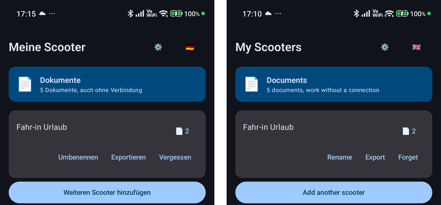
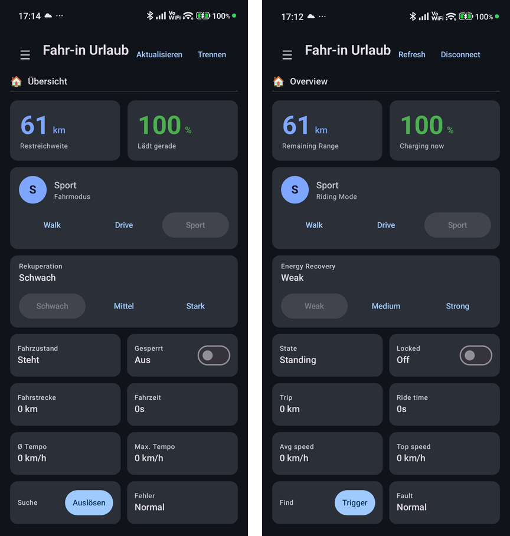
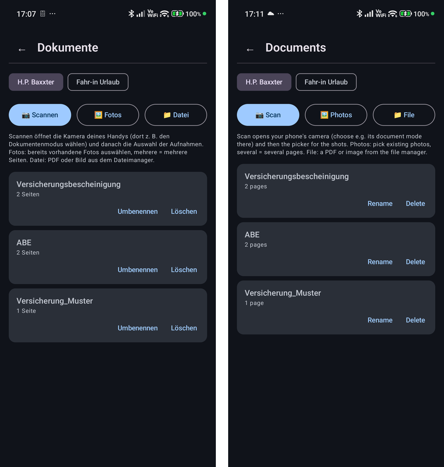
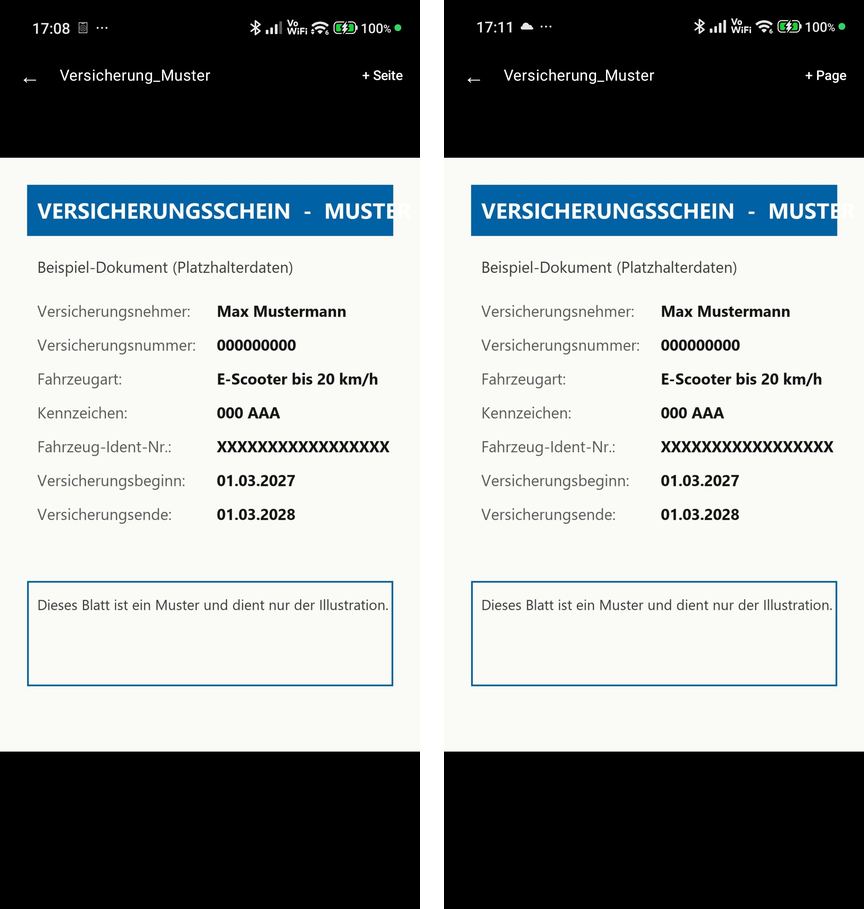
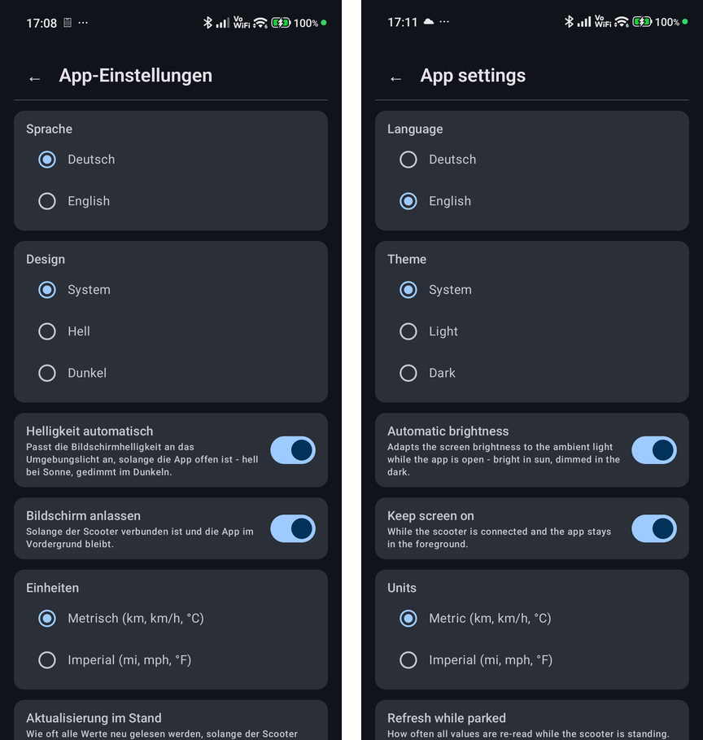

# Scooter RE Client — Xiaomi Electric Scooter (Android)

**[Deutsch](#deutsch) | [English](#english)**

**Alternative Android-App für den Xiaomi Electric Scooter 5 Pro / 5 Max — Dashboard, Fahrmodi, Sperre, Akku- und Fahrdaten direkt per Bluetooth, ohne Mi-Home-App.**
*An alternative Android app for the Xiaomi Electric Scooter 5 Pro / 5 Max — dashboard, ride modes, lock, battery and ride data over Bluetooth Low Energy, no Mi Home app needed.*

---

## Screenshots

Links die deutsche, rechts die englische Oberfläche — die App schaltet per Knopfdruck um.
*Left the German, right the English UI — the app switches language at the tap of a button.*
(Beispieldaten, MAC-Adressen entfernt / sample data, MAC addresses removed.)

**Geräteliste mit Dokumente-Kachel · Device list with documents tile**



**Übersicht · Overview**



**Dokumente pro Scooter · Documents per scooter**



**Vorzeige-Ansicht (Musterdokument) · Show-it view (sample document)**



**App-Einstellungen · App settings**



---

## Deutsch

Ein eigenständiger, quelloffener Android-Client für **Xiaomi Electric Scooter** der 5er-Reihe
(getestet: 5 Pro und 5 Max), der das Fahrzeug direkt per Bluetooth Low Energy anspricht — ohne
die offizielle Mi-Home-App. Das komplette BLE-Auth-Protokoll (ECDH P-256 → HKDF-SHA256 →
AES-CCM) wurde durch eigene Reverse-Engineering-Arbeit nachvollzogen und ist Byte für Byte
gegen beide realen Geräte verifiziert.

Dies ist ein unabhängiges, nicht-kommerzielles Projekt ohne Verbindung zu Xiaomi.

### ⚠️ Haftungsausschluss

**Die Nutzung dieser Software erfolgt vollständig auf eigenes Risiko. Der Autor übernimmt keinerlei
Haftung für Schäden, Verletzungen, Bußgelder, Garantieverlust, Kontosperrungen oder sonstige
Folgen jeder Art, die aus der Nutzung, Installation oder Modifikation dieser Software entstehen
— unabhängig davon, ob diese Folgen vorhersehbar waren oder nicht.** Das gilt in vollem, gesetzlich
zulässigem Umfang (siehe auch [LICENSE](LICENSE), Abschnitt "No Liability", die rechtlich bindende
Fassung dieses Ausschlusses).

- **Keine Verbindung zu und keine Unterstützung durch Xiaomi.** Dieses Projekt steht in keiner
  Beziehung zu Xiaomi Corporation oder verbundenen Unternehmen, ist nicht von Xiaomi autorisiert,
  gesponsert oder geprüft. Alle Marken- und Produktnamen gehören ihren jeweiligen Inhabern.
- **Keine Gewährleistung, keine Garantie für Funktion, Sicherheit oder Korrektheit.** Die Software
  wird **"as is"**, ohne jede ausdrückliche oder stillschweigende Zusicherung bereitgestellt —
  weder für Eignung zu einem bestimmten Zweck noch für Fehlerfreiheit. Ein durch Reverse
  Engineering nachgebautes Protokoll kann Fehlinterpretationen enthalten; fehlerhafte Befehle
  könnten im ungünstigsten Fall dein Gerät beschädigen, Fahrfunktionen beeinträchtigen oder zu
  unerwartetem Verhalten während der Fahrt führen.
- **Verantwortung für Straßenverkehr und Sicherheit liegt vollständig bei dir.** Die App zeigt bei
  bestimmten Einstellungen (z.B. Tempomat, Beleuchtung) Warnhinweise an — das ersetzt keine eigene
  Prüfung der in deinem Land/deiner Region geltenden Vorschriften für Elektrokleinstfahrzeuge.
  Nutze keine Funktion während der Fahrt in einer Weise, die dich selbst oder andere gefährdet
  oder gegen geltendes Recht verstößt.
- **Nur für eigene Geräte verwenden.** Die Software ist für Interoperabilität mit Geräten gedacht,
  die dir (oder Personen, die dir ausdrücklich Zugriff gewähren, z.B. über die
  Export/Import-Funktion) gehören — nicht für fremde Geräte ohne Zustimmung des Eigentümers.
- **Getestet am Xiaomi Electric Scooter 5 Pro und 5 Max** (BLE-Chip RTL8762C, Firmware
  2.7.0_0015.x). Ob weitere Modelle der 5er-Reihe (z.B. "Electric Scooter 5" ohne "Pro"/"Max")
  dasselbe Protokoll sprechen, ist **nicht verifiziert** — die App verwendet in diesem Fall die
  5-Pro-Tabelle als ungeprüften Startpunkt.
- **Keine Geschwindigkeitsbegrenzung wird umgangen.** Dieses Projekt implementiert bewusst
  **keine** Funktion zum Ändern der regionalen Geschwindigkeitsbegrenzung oder zum Beschreiben
  der Motorsteuerungs-Firmware — das würde physischen ST-Link/SWD-Zugriff auf den Motorcontroller
  erfordern und wurde absichtlich nicht gebaut, unabhängig vom Anwendungsfall. Wer diesen Code
  als Ausgangspunkt für sowas nimmt, tut das eigenverantwortlich und außerhalb dessen, wofür
  dieses Projekt gedacht ist.
- **Cloud-Zugangsdaten und Nutzungsbedingungen.** Der Cloud-Login-Teil spricht undokumentierte,
  interne Xiaomi-Cloud-Schnittstellen an. Das kann gegen die Nutzungsbedingungen deines
  Xiaomi-Kontos verstoßen; im ungünstigsten Fall könnte das zu Einschränkungen deines Kontos
  führen. Passwort und Geräte-PIN werden nirgends fest im Code und auch nicht auf deinem Gerät
  gespeichert — sie werden nur für den einmaligen Login bzw. Schlüsselabruf gebraucht; abgelegt wird
  nur der daraus gewonnene BLE-Schlüssel, verschlüsselt über den Android Keystore — trotzdem
  gilt: Nutzung dieser Schnittstellen ist eigenverantwortlich. Dasselbe gilt für den exportierten
  Zugangscode und die Exportdatei (Export/Import-Funktion): sie enthalten den vollständigen
  BLE-Schlüssel eines Geräts (die Datei zusätzlich Dokumente und Verlauf) und sollten nur an
  Personen weitergegeben werden, die dieses Gerät auch tatsächlich mitbenutzen dürfen — die Datei
  am besten mit Passwort verschlüsselt.
- **Persönliche Dokumente.** Die Dokumente-Funktion legt Fotos/PDFs deiner Unterlagen (z.B.
  Versicherungsbestätigung) im app-privaten Speicher deines Handys ab (nicht in der Galerie,
  unverschlüsselt); die Originalfotos der Kamera bleiben allerdings in deiner Galerie. Für den
  Umgang mit diesen personenbezogenen Daten bist du selbst verantwortlich. Ob eine digitale Kopie
  bei einer Kontrolle akzeptiert wird, entscheidet die kontrollierende Stelle — das ist keine
  Rechtsberatung; im Zweifel die Originale mitführen.
- **Kein Support, keine Zusicherung von Weiterentwicklung.**
  Xiaomi kann das Protokoll jederzeit per Firmware-Update ändern und diese Software funktionsunfähig
  machen, ohne dass eine Aktualisierung dieses Repositories zu erwarten ist.

### Funktionsumfang

**Fahren und Überblick**

- **Übersicht** als Startseite nach dem Verbinden: Restreichweite und Akkustand groß, Fahrmodus
  (Walk/Drive/Sport) und Rekuperation direkt umschaltbar, dazu Fahrzustand, Strecke, Fahrzeit,
  Ø-/Max-Tempo, Sperre, Scooter-Suche und Fehlerstatus — alles auf einem Bildschirm.
- **Seitenmenü** mit den Bereichen Fahrt, Akku, Einstellungen, Fahrzeug, Identifikation,
  Fahrtenbuch, Verlauf und App-Einstellungen. Alle bekannten MIoT-Properties mit korrekter
  Einheiten-/Skalierungsanzeige und Klartext statt Rohwerten; die meisten Einstellungen sind
  setzbar, mit Sicherheits-/Rechtshinweis bei regional heiklen Funktionen (Tempomat, Rücklicht).
- **Live-Werte**: automatische Aktualisierung; während der Fahrt etwa alle 2,5 s (die
  fahrrelevanten Werte), im Stand einstellbar (sparsam/normal/schnell).
- **Fahrtenbuch** (die letzten Fahrten des Scooters) als Datei exportierbar; **Verbrauchs-Verlauf**
  (gefahrene km und Wh/km je Fahrmodus, experimentell): nach dem Verbinden fragt die App, in
  welchem Modus zuletzt gefahren wurde.
- **Reifenwartung**: Erinnerung ein/aus und Intervall (14–180 Tage) einstellbar.
- **Homescreen-Widget** mit dem letzten Stand (Akku, Sperre, Reichweite).

**Dokumente pro Scooter** (offline, ohne Verbindung zum Scooter)

- Kachel „Dokumente" ganz oben in der Geräteliste plus „📄 N"-Button an jeder Scooter-Karte.
- **Scannen** öffnet die Kamera-App deines Handys (dort z.B. den Dokumentenmodus wählen) und danach
  die Foto-Auswahl; **Fotos** nimmt vorhandene Fotos; **Datei** importiert ein PDF oder Bild.
  Mehrere markierte Fotos werden **ein** mehrseitiges Dokument, weitere Seiten lassen sich später
  ergänzen.
- **Vorzeige-Ansicht**: Vollbild, Blättern, Zoom, Bildschirm bleibt an, volle Helligkeit; PDFs
  Seite für Seite. Umbenennen und Löschen mit Rückfrage.

**Mehrere Scooter, Export und Import**

- Beliebig viele Scooter parallel: speichern, umbenennen, (mit Bestätigung) vergessen — das
  Vergessen entfernt auch die Dokumente und den Verlauf des Scooters.
- **Export mit allem, was zum Scooter gehört** (Schlüssel, Name/Modell, Dokumente, Verlauf) in
  einer Datei, optional mit einem frei wählbaren Passwort verschlüsselt (AES-256). Der Import
  erkennt die Datei selbst und fragt bei Bedarf nach dem Passwort. Daneben gibt es weiter den
  kurzen Text-Code (nur Schlüssel) für den schnellen Fall.
- Anmeldung direkt in der App: Cloud-Login (Passwort **oder** QR-Code über Chrome Custom Tabs —
  auch für Konten ohne eigenes Xiaomi-Passwort, z.B. bei Google-Anmeldung), BLE-Scan ohne
  bekannte MAC-Adresse, automatischer Bezug des BLE-Schlüssels (`ltmk`).

**App-Einstellungen** (auch ohne verbundenen Scooter erreichbar)

- Sprache (Deutsch/Englisch), Design (System/Hell/Dunkel), automatische Helligkeit per
  Lichtsensor (experimentell), Bildschirm anlassen, Einheiten (metrisch/imperial), Aktualisierung
  im Stand, automatisch mit dem zuletzt genutzten Scooter verbinden, Bestätigung vor
  Sperren/Entsperren, Fahrten-Abfrage ein/aus, Update-Hinweis (prüft einmal täglich GitHub auf
  eine neuere Version, abschaltbar).
- Die Zurück-Geste geht stufenweise: Menü schließen → Übersicht → sauber trennen zur
  Geräteliste → App beenden. Zusätzlich gibt es den „Trennen"-Button.

**Technik**: persistente BLE-Sitzung (keine Neuverbindung pro Abfrage) mit automatischem
Wiederholungsversuch bei kurzzeitigen Verbindungsproblemen.

### Erste Schritte

1. APK aus den [Releases](https://github.com/desperado0044/xiaomi-scooter-5pro-ble/releases)
   laden und installieren (Sideload, „unbekannte Quellen" erlauben; es ist eine Debug-signierte
   APK, kein Play-Store-Release). Bluetooth-Berechtigung erlauben.
2. „Scooter hinzufügen": Cloud-Login (QR-Code oder Passwort), bei gesetzter Sharing-PIN die
   Geräte-PIN eingeben — die App holt den Schlüssel einmalig ab. Alternativ eine Exportdatei bzw.
   einen Code importieren.
3. Scooter in der Geräteliste antippen — die Übersicht öffnet sich.
4. Dokumente: Kachel „Dokumente" → Scannen, Fotos oder Datei.
5. Zweites Handy (z.B. Familie): am ersten Handy „Exportieren", Datei teilen, am zweiten
   „Scooter hinzufügen" → „Datei auswählen".

### Lizenz

[PolyForm Noncommercial License 1.0.0](LICENSE) — freie Nutzung, Weitergabe und Veränderung für
**jeden nicht-kommerziellen Zweck** (privat, Forschung, Lehre, Hobby). Kommerzielle Nutzung,
egal ob als Open- oder Closed-Source-Produkt, ist **nicht** gestattet. Das ist bewusst so
gewählt: niemand soll mit dieser Arbeit Geld verdienen, weder ich noch sonst wer.

### Danksagung / Grundlagen

Ohne folgende Vorarbeiten anderer wäre dieses Projekt nicht möglich gewesen:

- [KuziaMother/SCOOTER_5_PRO](https://github.com/KuziaMother/SCOOTER_5_PRO) — die entscheidende
  Referenz für das BLE-Auth-Protokoll dieses Geräts (ECDH/HKDF/AES-CCM-Ablauf, Kanaltransport,
  MIoT-Property-Layer). Dessen Code wird hier **nicht mitgeliefert**, nur eigenständig in Kotlin
  neu implementiert und gegen die realen Geräte verifiziert.
- [PiotrMachowski/Xiaomi-cloud-tokens-extractor](https://github.com/PiotrMachowski/Xiaomi-cloud-tokens-extractor) —
  Vorlage für den Mi-Cloud-Login-Ablauf (RC4-Verschlüsselung, Signatur, `askbluetoothkey`), hier
  eigenständig nach Kotlin portiert.

Der vollständige, chronologische Reverse-Engineering-Prozess (inkl. Sackgassen, verworfener
Hypothesen und aller Zwischenschritte) ist dokumentiert in [`docs/RESEARCH_LOG.md`](docs/RESEARCH_LOG.md).

### Bauen

```
cd android-app
./gradlew assembleDebug
```

APK liegt danach unter `android-app/app/build/outputs/apk/debug/`. Benötigt: Android SDK,
minSdk 26 (Android 8.0), getestet auf Android 15/16 sowie (nur BLE-Verbindungsprüfung) Android 9.

---

## English

A standalone, open-source Android client for **Xiaomi Electric Scooter** 5-series models
(tested: 5 Pro and 5 Max) that talks to the vehicle directly over Bluetooth Low Energy —
without the official Mi Home app. The complete BLE auth protocol (ECDH P-256 → HKDF-SHA256 →
AES-CCM) was reverse-engineered from scratch and is verified byte-for-byte against both real
devices.

This is an independent, non-commercial project with no affiliation with Xiaomi.

### ⚠️ Disclaimer

**Use of this software is entirely at your own risk. The author accepts no liability whatsoever
for damage, injury, fines, warranty loss, account suspension, or any other consequence of any
kind arising from the use, installation, or modification of this software — regardless of
whether such consequences were foreseeable.** This applies to the fullest extent permitted by
law (see also [LICENSE](LICENSE), "No Liability" section, the legally binding version of this
disclaimer).

- **No affiliation with, and no support from, Xiaomi.** This project has no relationship with
  Xiaomi Corporation or its affiliates, and is not authorized, sponsored, or reviewed by Xiaomi.
  All trademarks and product names belong to their respective owners.
- **No warranty, no guarantee of function, safety, or correctness.** The software is provided
  **"as is"**, without any express or implied warranty — neither fitness for a particular purpose
  nor freedom from defects. A protocol reconstructed through reverse engineering may contain
  misinterpretations; incorrect commands could, in the worst case, damage your device, impair
  ride functions, or cause unexpected behavior while riding.
- **Responsibility for road safety and traffic law is entirely yours.** The app shows warnings
  for certain settings (e.g. cruise control, tail light) — this does not replace your own review
  of the rules that apply to light electric vehicles in your country/region. Do not use any
  function while riding in a way that endangers yourself or others, or that violates applicable
  law.
- **For use with your own devices only.** This software is intended for interoperability with
  devices that belong to you (or to someone who has explicitly granted you access, e.g. via the
  export/import feature) — not for someone else's device without the owner's consent.
- **Tested on the Xiaomi Electric Scooter 5 Pro and 5 Max** (BLE chip RTL8762C, firmware
  2.7.0_0015.x). Whether other 5-series models (e.g. "Electric Scooter 5" without "Pro"/"Max")
  speak the same protocol is **not verified** — the app falls back to the 5 Pro's property table
  as an unverified starting point in that case.
- **No speed limiter is bypassed.** This project deliberately implements **no** function to
  change the regional speed limit or to flash the motor-controller firmware — that would require
  physical ST-Link/SWD access to the motor controller and was intentionally not built, regardless
  of use case. Anyone using this code as a starting point for that does so on their own
  responsibility and outside what this project is intended for.
- **Cloud credentials and terms of service.** The cloud-login part talks to undocumented, internal
  Xiaomi cloud APIs. This may violate your Xiaomi account's terms of service; in the worst case it
  could lead to restrictions on your account. Password and device PIN are never hardcoded anywhere
  and are not stored on your device either — they are only needed for the one-time login / key
  retrieval; only the BLE key obtained with them is stored, encrypted via the Android Keystore —
  even so, use of these APIs is at your own responsibility. The same applies to an exported access
  code and export file (export/import feature): they contain the full BLE key for a device (the
  file also documents and history) and should only be shared with people who are actually allowed
  to use that device — preferably with the file encrypted by a password.
- **Personal documents.** The documents feature stores photos/PDFs of your papers (e.g. insurance
  confirmation) in your phone's app-private storage (not in the gallery, unencrypted); the
  original camera photos do stay in your gallery, though. You are responsible for handling this
  personal data. Whether a digital copy is accepted at a check is up to the checking authority —
  this is not legal advice; carry the originals if in doubt.
- **No support, no promise of continued development.** Xiaomi can
  change the protocol at any time via a firmware update and render this software non-functional,
  with no update to this repository to be expected.

### Features

**Riding and overview**

- **Overview** as the start page after connecting: remaining range and battery level in large
  numbers, riding mode (Walk/Drive/Sport) and energy recovery switchable right there, plus riding
  state, trip, ride time, average/top speed, lock, find-my-scooter and fault status — all on one
  screen.
- **Side menu** with the sections Ride, Battery, Settings, Vehicle, Identification, Ride log,
  History and App settings. All known MIoT properties with correct unit/scaling display and plain
  text instead of raw values; most settings are settable, with a safety/legal note for regionally
  sensitive functions (cruise control, tail light).
- **Live values**: automatic refresh; about every 2.5 s while riding (the ride-relevant values),
  adjustable while parked (economy/normal/fast).
- **Ride log** (the scooter's most recent rides) can be exported as a file; **consumption
  history** (distance and Wh/km per riding mode, experimental): after connecting, the app asks
  which mode you mostly rode in.
- **Tire maintenance**: reminder on/off and interval (14–180 days) settable.
- **Home-screen widget** with the last known status (battery, lock, range).

**Documents per scooter** (offline, no connection to the scooter needed)

- A "Documents" tile at the top of the device list plus a "📄 N" button on every scooter card.
- **Scan** opens your phone's camera app (choose e.g. its document mode there) and then the photo
  picker; **Photos** takes existing photos; **File** imports a PDF or image. Several selected
  photos become **one** multi-page document, more pages can be added later.
- **Show-it view**: full screen, paging, zoom, screen stays on, full brightness; PDFs page by
  page. Rename and delete with confirmation.

**Multiple scooters, export and import**

- Any number of scooters side by side: save, rename, forget (with confirmation) — forgetting also
  removes the scooter's documents and history.
- **Export of everything that belongs to a scooter** (key, name/model, documents, history) in one
  file, optionally encrypted with a password of your choice (AES-256). Import recognizes the file
  by itself and asks for the password if needed. The short text code (key only) remains for the
  quick case.
- Sign-in directly in the app: cloud login (password **or** QR code via Chrome Custom Tabs — also
  for accounts without a separate Xiaomi password, e.g. Google sign-in), BLE scan without
  knowing the MAC address, automatic retrieval of the BLE key (`ltmk`).

**App settings** (also reachable without a connected scooter)

- Language (German/English), theme (system/light/dark), automatic brightness via the light sensor
  (experimental), keep screen on, units (metric/imperial), refresh while parked, connect
  automatically to the last used scooter, confirmation before lock/unlock, ride prompt on/off,
  update notice (checks GitHub once a day for a newer version, can be turned off).
- The back gesture steps outward: close menu → overview → clean disconnect to the device list →
  leave the app. There is also a "Disconnect" button.

**Under the hood**: persistent BLE session (no reconnect per request) with automatic retry on
transient connection issues.

### Getting started

1. Download the APK from the [Releases](https://github.com/desperado0044/xiaomi-scooter-5pro-ble/releases)
   and install it (sideload, allow "unknown sources"; it is a debug-signed APK, not a Play Store
   release). Allow the Bluetooth permission.
2. "Add scooter": cloud login (QR code or password); if a sharing PIN is set, enter the device PIN
   — the app fetches the key once. Alternatively import an export file or code.
3. Tap the scooter in the device list — the overview opens.
4. Documents: "Documents" tile → Scan, Photos or File.
5. Second phone (e.g. family): on the first phone "Export", share the file, on the second
   "Add scooter" → "Choose file".

### License

[PolyForm Noncommercial License 1.0.0](LICENSE) — free to use, share, and modify for **any
non-commercial purpose** (personal, research, teaching, hobby). Commercial use, whether as an
open- or closed-source product, is **not** permitted. This is a deliberate choice: nobody should
make money off this work, not me and not anyone else.

### Acknowledgments / Foundations

This project would not have been possible without the following prior work by others:

- [KuziaMother/SCOOTER_5_PRO](https://github.com/KuziaMother/SCOOTER_5_PRO) — the decisive
  reference for this device's BLE auth protocol (ECDH/HKDF/AES-CCM flow, channel transport, MIoT
  property layer). Its code is **not bundled** here, only independently reimplemented in Kotlin
  and verified against the real devices.
- [PiotrMachowski/Xiaomi-cloud-tokens-extractor](https://github.com/PiotrMachowski/Xiaomi-cloud-tokens-extractor) —
  template for the Mi Cloud login flow (RC4 encryption, signature, `askbluetoothkey`),
  independently ported to Kotlin here.

The full, chronological reverse-engineering process (including dead ends, discarded hypotheses,
and every intermediate step) is documented in [`docs/RESEARCH_LOG.md`](docs/RESEARCH_LOG.md).

### Building

```
cd android-app
./gradlew assembleDebug
```

The APK lands under `android-app/app/build/outputs/apk/debug/`. Requires the Android SDK,
minSdk 26 (Android 8.0); tested on Android 15/16, plus (BLE connectivity check only) Android 9.
